# 操作系统

## 操作系统基本概念

### 操作系统的启动

​	DiSK:存放OS

​	BIOS:基本I/O处理系统

​	bootload:加载OS


```markdown
	* 在计算机运行中，内核是被信任的第三方
	* 只有内核可以执行特权指令
	* 为了方便应用程序
```


```markdown
* 操作系统如何设计和实现中断、异常和系统调用
* 它们三者有什么区别
```

​	

 - 源头
   - 中断:外设
   - 异常:应用程序意想不到的行为
   - 系统调用:应用程序请求操作提供服务

* 处理时间
  		* 中断:异步
    		* 异常:同步
    		* 系统调用:异步或同步

* 响应
  		- 中断:持续，对用户应用程序是透明的
    		- 异常:杀死或者重新执行意想不到的应用程序指令
    		- 系统调用:等待和持续

### 操作系统的的中断、异常、和系统调用

**中断**

​	硬件

  - 设置中断标记[CPU初始化]
    1. 将内部、外部事件设置中断标记
    2. 中断事件的ID

​	软件

- 保存当前处理状态(保护现场)
- 中断服务程序处理
- 清除中断标记
- 恢复之前保存的处理状态(恢复现场)

**异常**:异常编号

 - 保存现场
 - 异常处理

   		- 杀死产生了异常的程序
- ==重新执行==异常指令
- 恢复现场

**系统调用**

​	**跨越操作系统边界的开销**

- 在执行时间上的开销超过程序调用
- 开销：
  - 建立中断/异常/系统调用号与对应服务例程映射关系的初始化开销
  - 建立内核堆栈
  - 验证參数
  - 内核态映射到用户态的地址空间更新页面映射权限
  - 内核态独立地址空间 TLB


## 内存管理

### 计算机体系结构及内存分层体系

 - 在操作系统中管理内存的不同方法
   - 程序重定位
   - 分段
   - 分页
   - 虚拟内存
   - 按需分页虚拟内存

 - 实现高度依赖硬件
   - 必须知道内存架构
   - MMU(内存管理单元)：硬件组件负责处理 CPU的内存访问请求

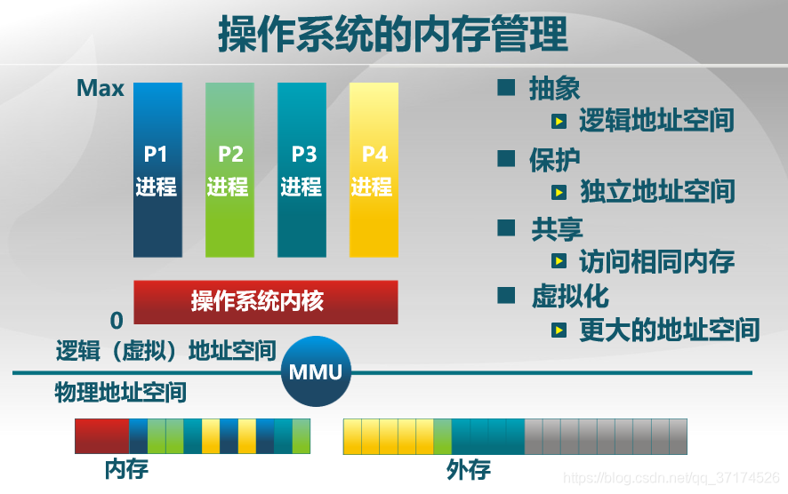

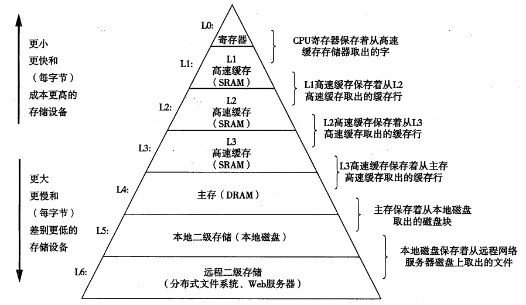

### 地址空间与地址生成

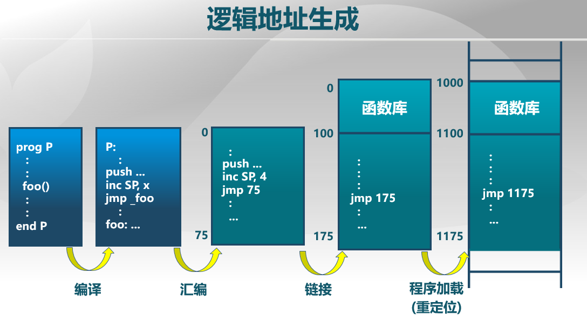

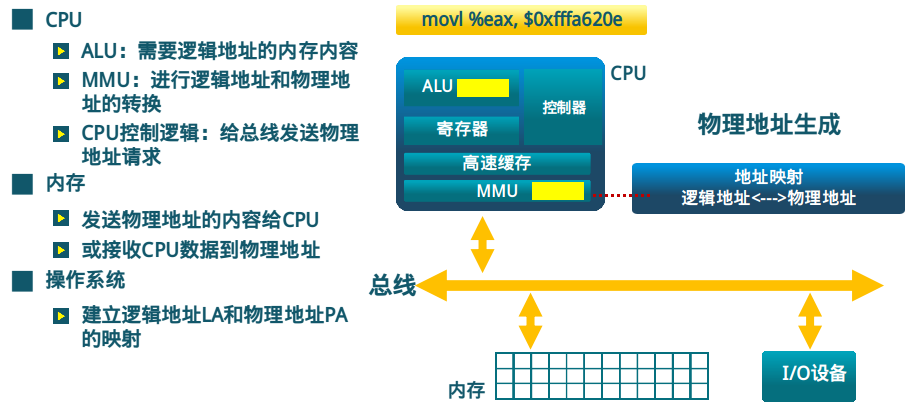

### 连续内存分配：内存碎片与分区的动态分配

​	内部碎片:已经被分配出去的的内存空间大于请求所需的内存空间

​	外部碎片:还没有分配出去，但是由于大小太小而无法分配给申请空间的新进程的内存空间空闲块。

 1. **首次适配：空闲分区以地址递增的次序链接。分配内存时顺序查找，找到大小能满足要求的第一个空闲分区。**

    优点:

     - **简单**
     - **在高地址空间有大块的空闲分区**

    缺点:

    * **会产生外部碎片** 
    * **分配大块地址空间较慢**

 2. **最优适配：空闲分区按容量递增形成分区链，找到第一个能满足要求的空闲分区。**

    优点:

     * **大部分分配的尺寸较小时，效果较好**

     * ##### 可避免大的空闲分区被拆分

     * ##### 可减小外部碎片的大小

     * ##### 相对简单

缺点:

* **会产生外部碎片**
* **释放分区较慢**
* **容易产生很多无用的小碎片**

 3. **最坏适配：空闲分区以容量递减的次序链接。找到第一个能满足要求的空闲分区，也就是挑选出最大的分区。**

    优点:

    * ##### 中等大小的分配较多时，效果较好

    * ##### 避免出现太多的小碎片

    缺点:

    * **释放分区慢**
    * *外部碎片** 
    * **容易破坏大的空闲分区，因此后续难以分配大的分区**


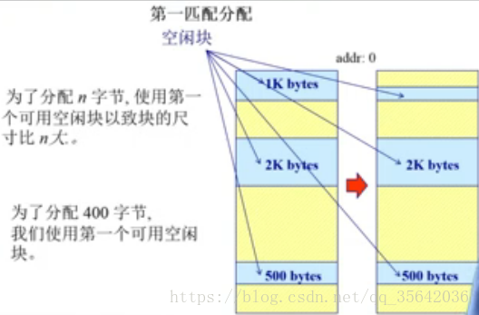

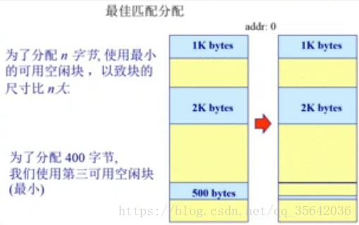

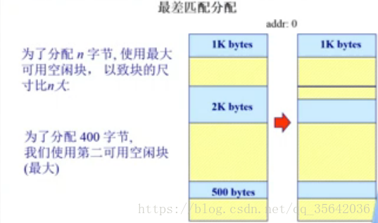

### 连续内存分配：压缩式与交换式碎片整理

- **压缩式内存整理**

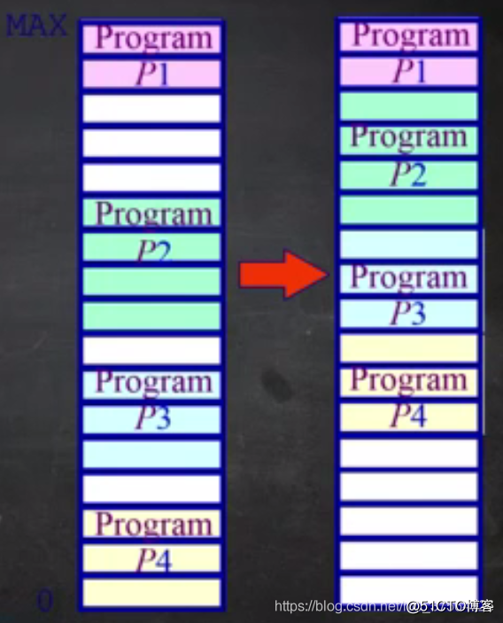

- **交换式内存整理**

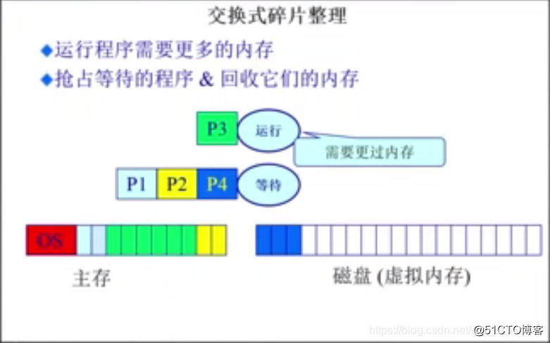

### 非连续内存分配

 * **连续分配内存的缺点**
   - 分配给一个程序的物理内存是连续的
   - 内存利用率较低
   - 有外碎片、内碎片的问题

* **非连续分配的优点**
  * 一个程序的物理地址空间是非连续的
  * 更好的内存利用和管理
  * 允许共享代码与数据（共享库等..）
  * 支持动态加载和动态链接

#### **分段**

​	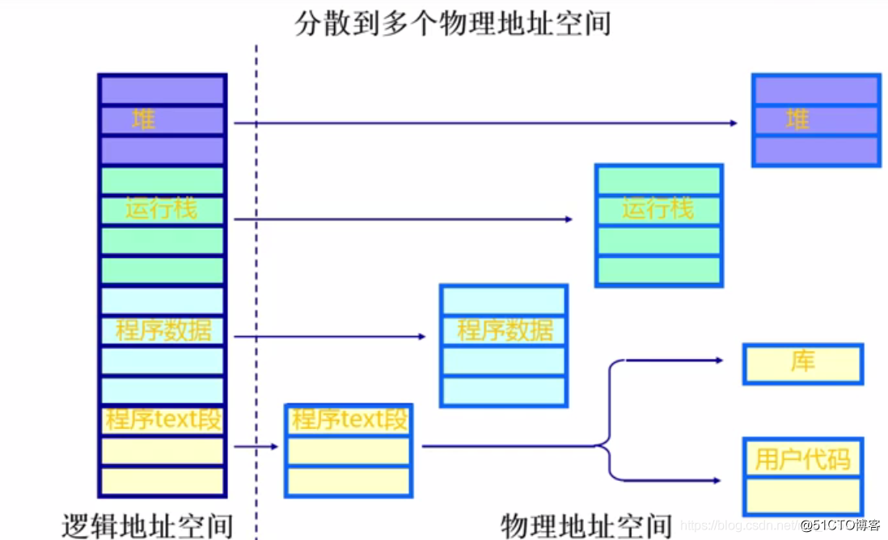

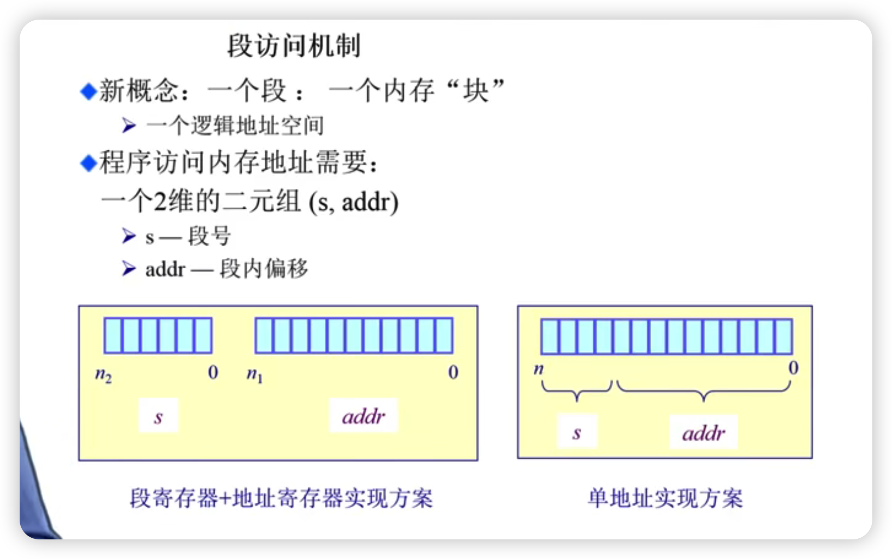


#### **分页**

 - 划分物理内存至固定大小的帧
   - 大小是2的幂，eg:512,4096,8192

* 划分逻辑地址空间至相同大小的页
  * 大小是2的幂，eg:512,4096,8192

- 建立方案 转换逻辑地址为物理地址
  - 页表
  - MMU/TLB

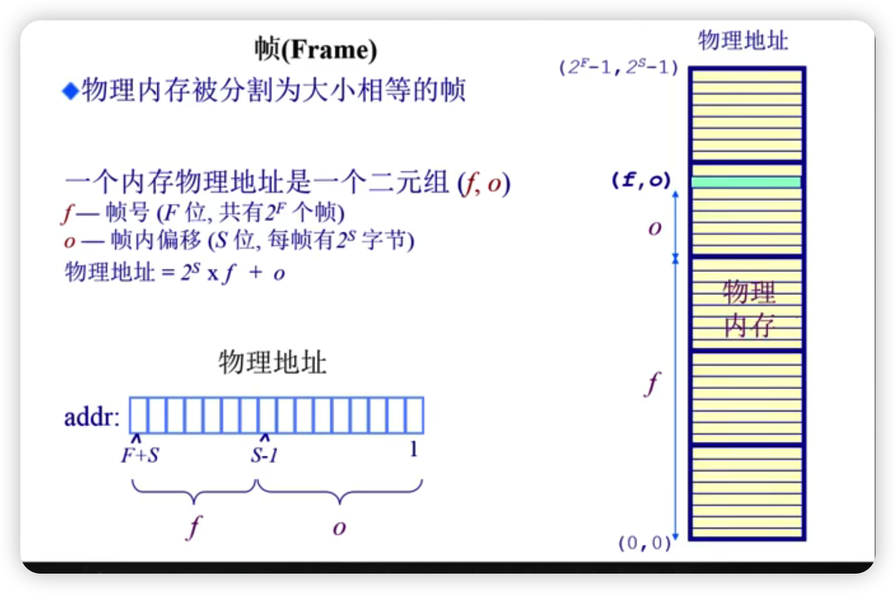

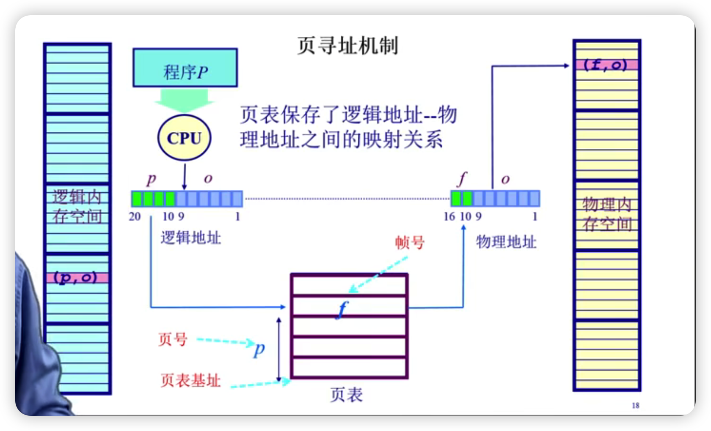

#### 页表

* 页表-概述、TLB

  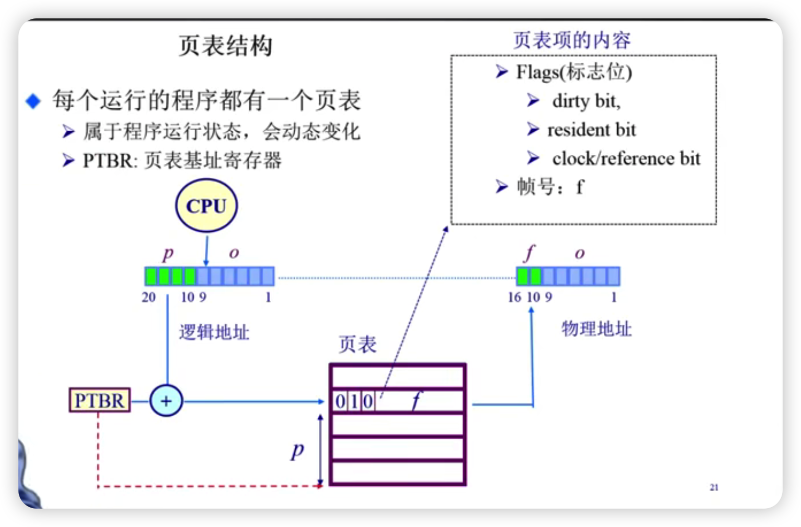

  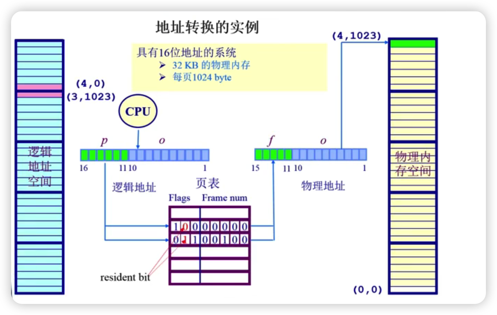

  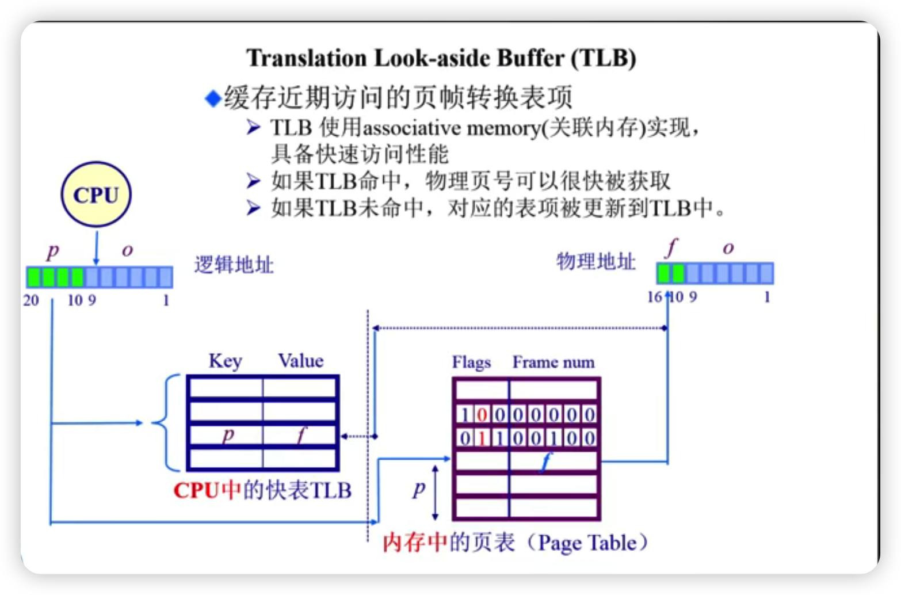

* 页表-二级、多级页表

  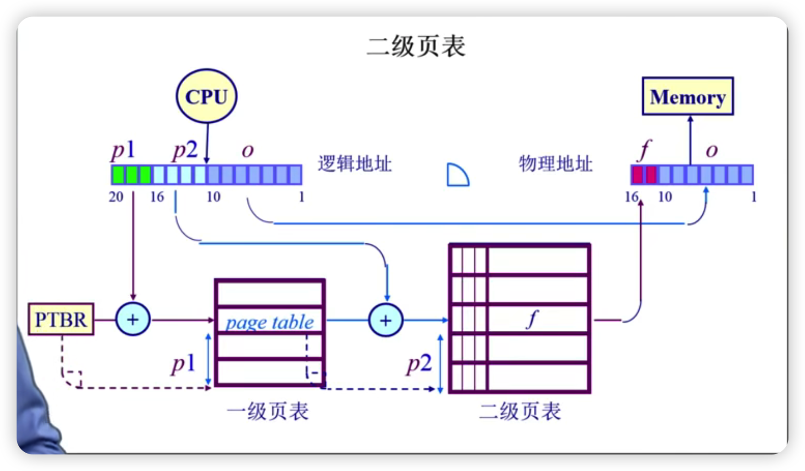

  **一级页表存放二级页表的基址**

* 页表-反向页表

​		**反向页表:**让页表和物理地址对应起来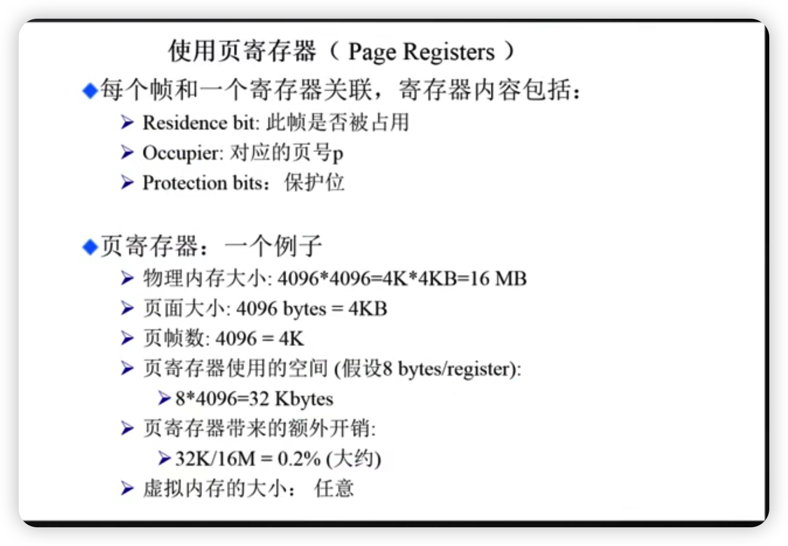

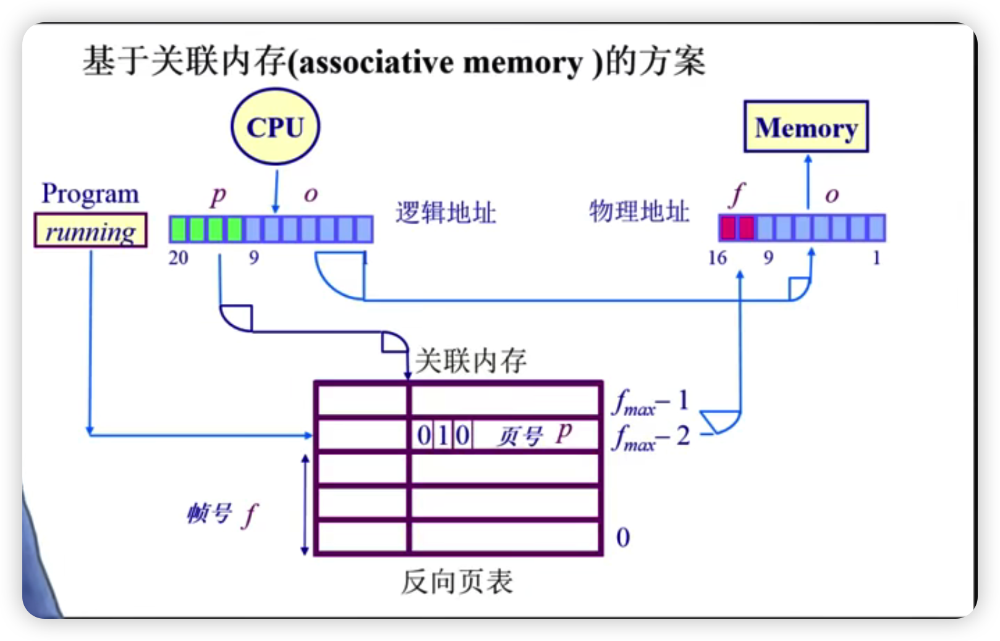


### 虚拟内存

#### 覆盖技术

目标：
**是在较小的可用内存中运行较大的程序。常用于多道程序系统，与分区存储管理配合使用。**
原理：
**把程序按照其自身逻辑结构，划分为若干个功能上相对独立的程序模块，那些不会同时执行的模块共享同一块内存区域，按时间先后来运行。**

**必要部分（常用功能）的代码和数据常驻内存；，**

**可选部分（不常用功能）在其他程序模块中实现，平时存放在外存中，在需要用到时才装入内存：**

**不存在调用关系的模块不必同时装入到内存，从而可以相互覆盖，即这些模块共用一个分区。**

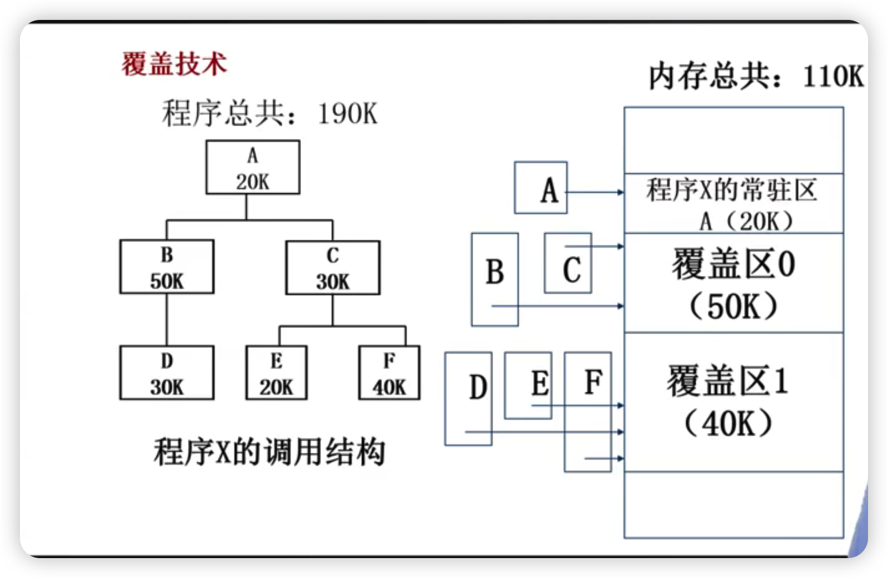

#### 交换技术

​	目标：

​	**多道程序在内存中时，让正在运行的程序或需要运行的程序获得更多的内存资源。**

​	方法：

​	**可将暂时不能运行的程序送到外存，从而获得空闲内存空间。**

​    **操作系统把一个进程的整个地址空间的内容保存到外存中（换出swap out），而将外存中的某个进程的地址空间读入到内存中（换	入 swap in）。换入换出内容的大小为整个程序的地址空间。**

 * 交换技术实现中的几个问题
   * **交换时机的确定：何时需要发生交换？只当内存空间不够或有
     不够的危险时换出；**
   * **交换区的大小：必须足够大以存放所有用户进程的所有内存映
     像的拷贝；必须能对这些内存映像进行直接存取：**
   * **程序换入时的重定位：换出后再换入的内存位置一定要在原来
     的位置上吗？最好采用动态地址映射的方法。**

* 覆盖技术与交换技术的比较
  * **覆盖只能发生在那些相互之间没有调用关系的程序模块之间，
    因此程序员必须给出程序内的各个模块之间的逻辑覆盖结构。**
  * **交换技术是以在内存中的程序大小为单位来进行的，它不需要
    程序员给出各个模块之间的逻辑覆盖结构。换言之，交换发生
    在内存中程序与管理程序或操作系统之间，而覆盖则发生在运
    行程序的内部。**

#### 虚存技术

​	**在内存不够用的情形下，可以采用覆盖技术和交换技术，但是：**
​	**覆盖技术：需要程序员自己把整个程序划分为若干个小的功能模块，并确定各个模块之间的覆盖关系，增加了程序员的负担；**
​	**交换技术：以进程作为交换的单位，需要把进程的整个地址空间都换进换出，增加了处理器的开销。**

​	目标：

 * **象覆盖技术那样，不是把程序的所有内容都放在内存中，因而
   能够运行比当前的空闲内存空间还要大的程序。但做得更好，由
   操作系统自动来完成，无须程序员的干涉：**
 * **象交换技术那样，能够实现进程在内存与外存之间的交换，因
   而获得更多的空闲内存空间。但做得更好，只对进程的部分内容
   在内存和外存之间进行交换。**

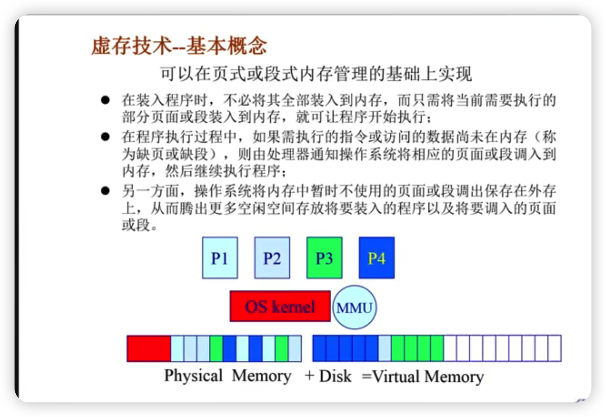

基本特征：

* **大的用户空间：通过把物理内存与外存相结合，提供给用户的虚拟内存空间通常大于实际的物理内存，即卖现了这两者的分离。如32位的虚拟地址理论上可以访问4GB，而可能计算机上仅有256M的物理内存，但硬盘容量大于4GB。**
* **部分交换：与交换技术相比较，虚拟存储的调入和调出是对部分虚拟地址空间进行的：**
* **不连续性：物理内存分配的不连续，虚拟地址空间使用的不连续。**

虚拟页式内存管理：

 * **大部分虚拟存储系统都采用虚拟页式存储管理技术，即在页式存储管理的基础上，增加请求调页和页面置换功能。**
 * 基本思路：
   **当一个用户程序要调入内存运行时，不是将该程序的所有页面都装入内存，而是只装入部分的页面，就可启动程序运行。在运行的过程中，如果发现要运行的程序或要访问数据不在内存，则向系统发出缺页中断请求，系统在处理这个中断时，将外存中相应的页面调入内存，使得该程序能够继续运行。**

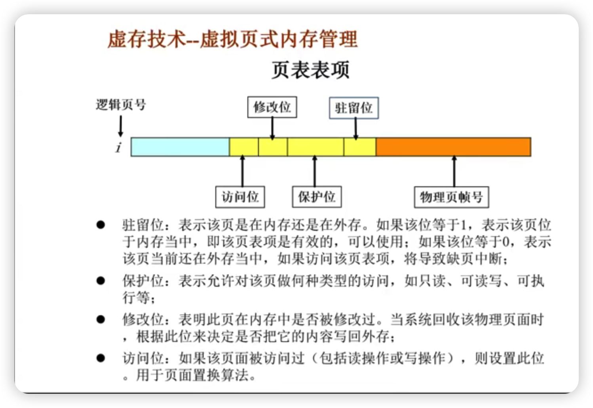


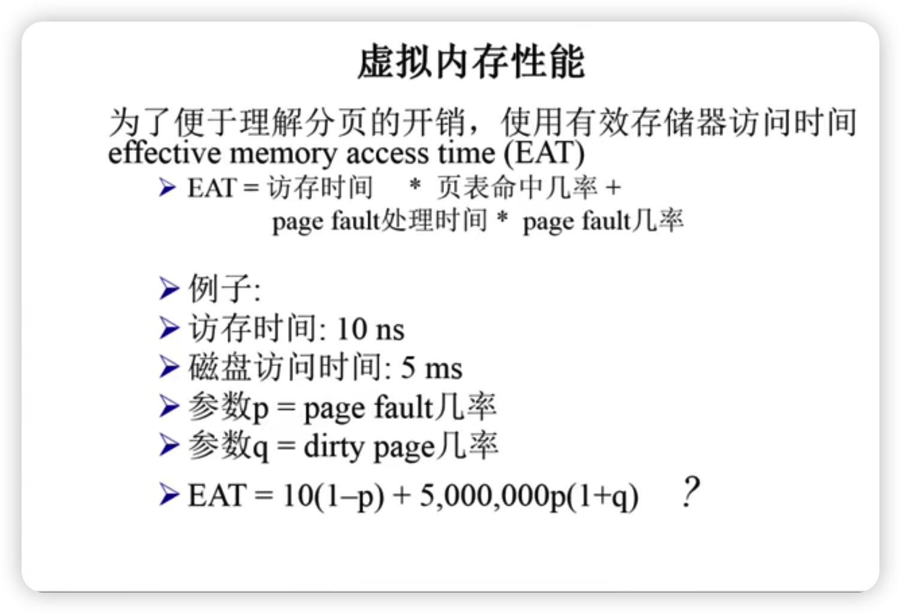

### 局部页面置换算法

概念：**进程运行过程中，访问的页面不在内存，调入时内存已无空闲空间，需要将内存中的一页程序或数据调到外存。**

#### 最优页面置换算法

功能：**当缺页中断发生，需要调入新的页面而内存已满时，选择内存当中哪个物理页面被置换。**
目标：**尽可能地减少页面的换进换出次数（即缺页中断的次数）。具体来说，把未来不再使用的或短期内较少使用的页面换出，通常只能在局部性原理指导下依据过去的统计数据来进行预测；**
页面锁定 (frame locking)：**用于描述必须常驻内存的操作系统的关键部分或时间关键(time-critical）的应用进程。实现的方法是：在页中添加锁定标志位(lock bit)。**

基本思路：**当一个缺页中断发生时，对于保存在内存当中的每一个逻辑页面，计算在它的下一次访问之前，还需等待多长时间，从中等待时间最长的那个，祚为被置换的页面。**

#### 先进先出算法(FIFO算法)

基本思路：**选择在内存中驻留时间最长的页面并淘汰之。具体来说，系统维护着一个链表，记录了所有位于内存当中的逻辑页面。从链表的排列顺序来看，链首页面的驻留时间最长，链尾页面的驻留时间最短。当发生一个缺页中断时，把链首页面淘汰出局，并把新的页面加到链表的末尾。**


#### 最近最久未使用算法(LRU算法)

基本思路：**当一个缺页中断发生时，选择最久末使用的那个页面，并淘汰之。**

**它是对最优贞面置换算法的一个近似，其依据是程序的局部性原理，即在最近一小段时间（最近几条指令）内，如果某些页面被频繁地访问，那么在将来的一小段时间内，它们还可能会再一次被频繁地访问。反过来说，如果在过去某些页面长时间末被访问，那么在将它们还可能会长时间地得不到访问。**

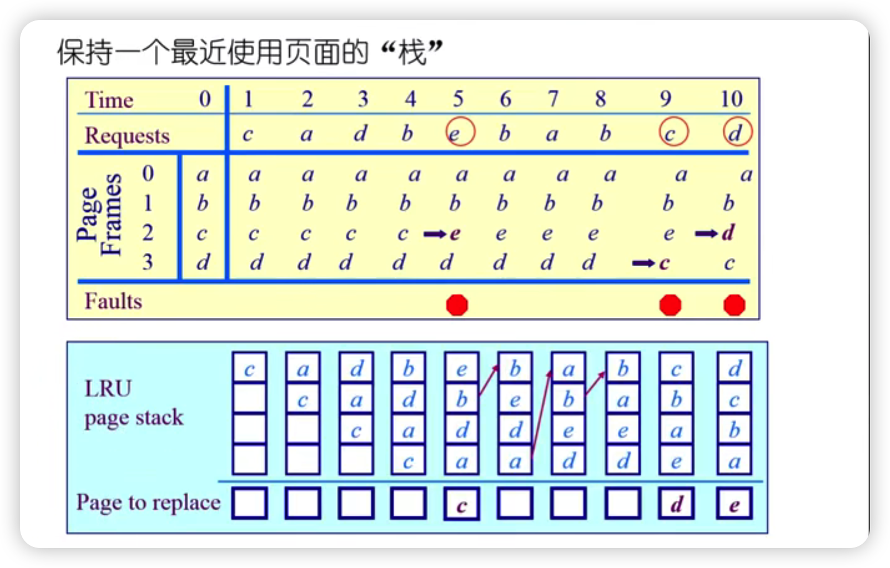

#### 时钟页面置换算法

​	基本思路：

* **需要用到页表项当中的访问位，当一个页面被装入内存时，把该位初始化为0。然后如果这个页面被访问（读/写），则把该位置1**
* **把各个页面组织成环形链表（类似钟表面），把指针指向最老的面（最先进来）；**
* **当发生一个缺页中断时，考察指针所指向的最老页面，若它的访问位为0，立即淘汰；若访问位为1，则把该位置为0，然后指针往下移动一格。如此下去，直到找到被淘汰的页面，然后把指针移动到它的下一格**

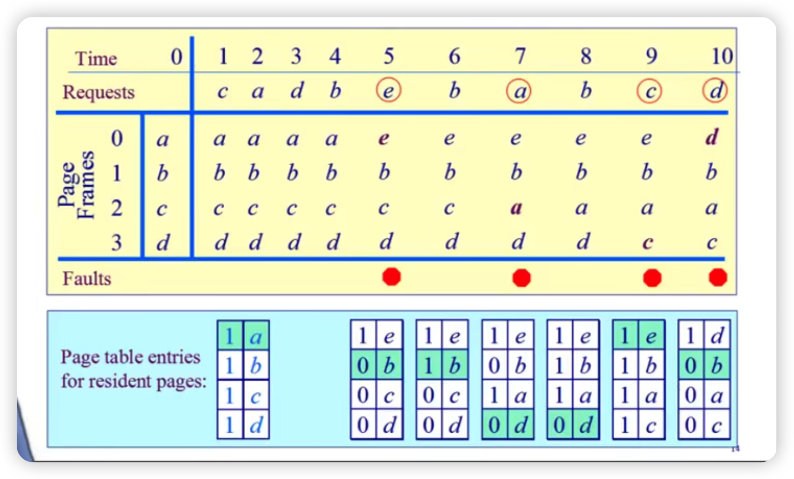

#### 二次机会法

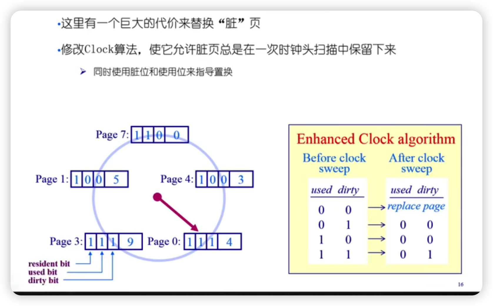

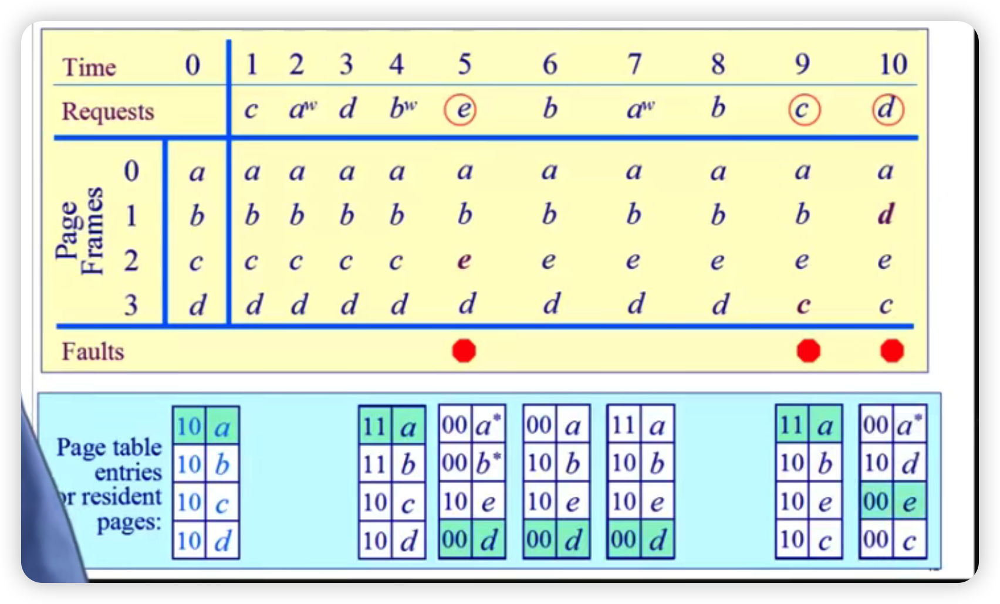

#### 最不常用算法(LFU)

基本思路：**当一个缺页中断发生时，选择==访问次数==最少的那个页面，并淘汰之**

### Belady现象

Belady现象：**在采用FIFO算法时，有时会出现分配的物理页面数增加，缺页率反而提高的异常现象；**

Belady现象的原因：**FIFO算法的置换特征与进程访问内存的动态特征是予盾的，与置换算法的目标是不一致的（即替换较少使用的面），因此，衱它置换出去的页面并不一定是进程不会访问的。**

### 工作集模型

​	工作集：**一个进程当前正在使用的逻辑页面集合**

​	常驻集：**常驻集是指在当前时刻，进程实际驻留在内存当中的页面集合。**

### 全局置换算法

#### 工作集页置换算法

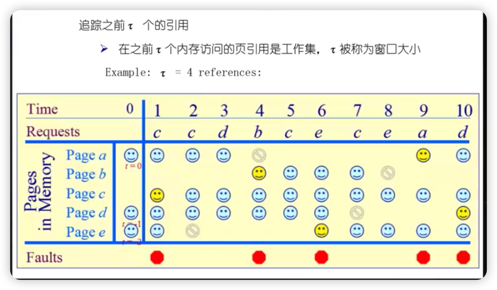

#### 缺页率算法


### 抖动问题

* **如果分配给一个进程的物理页面太少，不能包含整个的工作集，即常驻集 匚 工作集，那么进程将会造成很多的缺页中断，需要频地在内存与外存之间替换页面，从而使进程的运行速度变得很慢，我们把这种状态称为“抖动”。**
* **产生抖动的原因：随着驻留內存的进程数目增加，分配给每个进程的物理页面数不断减小，缺页率不断上升。所以OS要选择一个适当的进程数目和进程需要的帧数，以便在并发水平和缺页率之间达到一个平衡。**

## 进程管理

### 进程概念

进程的定义：**一个具有一定独立功能的程序在一个数据集合上的一次动态执行过程。**

进程的组成

* 程序的代码；
* 程序处理的数据；
* 程序计数器中的值，指示下一条将运行的指令；
* 一组通用的寄存器的当前值，堆、栈；
* 一组系统资源（如打开的文件）

进程与程序的区别

* 进程是动态的，程序是静态的：程序是有序代码的集合；进程是
  程序的执行，进程有核心态/用户态
* 进程是暂时的，程序是永久的：进程是一个状态变化的过程，程
  序可长久保存
* 进程与程序的组成不同：进程的组成包括程序、数据和进程控制
  块（即进程状态信息）

进程的特点

* 动态性：可动态地创建、结束进程；
* 并发性：进程可以被独立调度并占用处理机运行；井发并行
* 独立性：不同进程的工作不相互影响：
* 制约性：因访问共享数据/资源或进程间同步而产生制约。

### 进程控制结构

进程控制块：**操作系统管理控制进程运行所用的信息集合。操作系统用PCB来描述进程的基本情况以及运行变化的过程，PCB是进程存在的唯一标志。**

PCB三大类信息

1. 如本进程的标识，本进程的产生者标识（父进程标识）；用户标识。
2. 处理机状态信息保存区。保存进程的运行现场信息：
   * 用户可见寄存器，用户程序可以使用的数据，地址等寄存器。
   * 控制和状态寄存器，如程序计数器(PC)，程序状态字(PSW)。
   * 栈指针，过程调用/系统调用/中断处理和返回时需要用到它。

3. 进程控制信息
   * 调度和状态信息，用于操作系统调度进程并占用处理机使用。
   * 进程间通信信息，为支持进程间的与通信相关的各种标识、信号、信件等，
     这些信息存在接收方的进程控制块中。
   * 存储管理信息，包含有指向本进程映像存储空间的数据结构。
   * 进程所用资源，说明由进程打开、使用的系统资源，如打开的文件等。
   * 有关数据结构连接信息，进程可以连接到一个进程队列中，或连接到相关的其他进程的PCB。

### 进程生命期原理

1. 进程创建

引起进程创建的3个主要事件：

* 系统初始化时；
* 用户请求创建一个新进程；
* 正在运行的进程执行了创建进程的系统调用；

2. 进程运行

3. 进程等待

   在以下情况下，进程等待（阻塞）

   * 请求并等待系统服务，无法马上完成
   * 启动某种操作，无法马上完成
   * 需要的数据没有到达

4. 进程唤醒

   唤醒进程的原因：

   * 被阻塞进程需要的资源可被满足

   * 被阻塞进程等待的事件到达

   * 将该进程的PCB插入到就绪队列

5. 进程结束
   * 正常退出（自愿的）
   * 错误退出（自愿的）
   * 致命错误（强制性的）
   * 被其他进程所杀（强制性的）

### 进程状态模型

进程的三种基本状态(三态模型)：
	进程在生命结束前处于且仅处于三种基本状态之一不同系统设置的进程状态数目不同。

* **运行状态(Running)：当一个进程正在处理机上运行时。**
* **就绪状态(Ready)：一个进程获得了除处理机之外的一切所需资源，一旦得到处理机即可运行．**
* **等待状态（又称阻塞状态Blocked)：一个进程正在等待某一事件而暂停运行时。如等待某资源，等待输入/输出完成。**

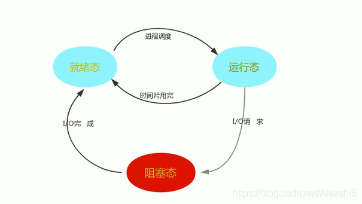

五态模型

**创建状态(New)：一个进程正在被创建，还没被转到就绪状态之前的状态。**
**结束状态(Exit)：一个进程正在从系统中消失时的状态，这是因为进程结束或由于其他原因所导致。**

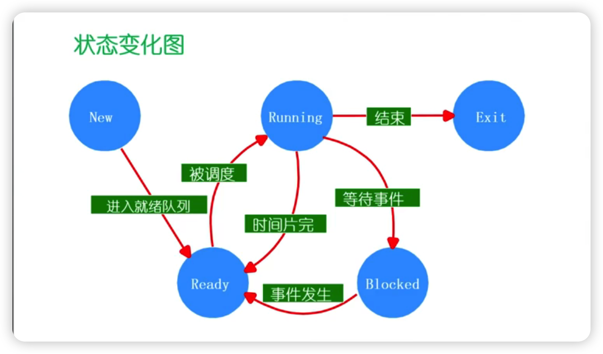

### 进程挂起

阻塞挂起状态 (Blocked-suspend)：**进程在外存并等待某事件的出现；**
就绪挂起状态(Ready-suspend）：**进程在外存，但只要进入内存，即可运行；**

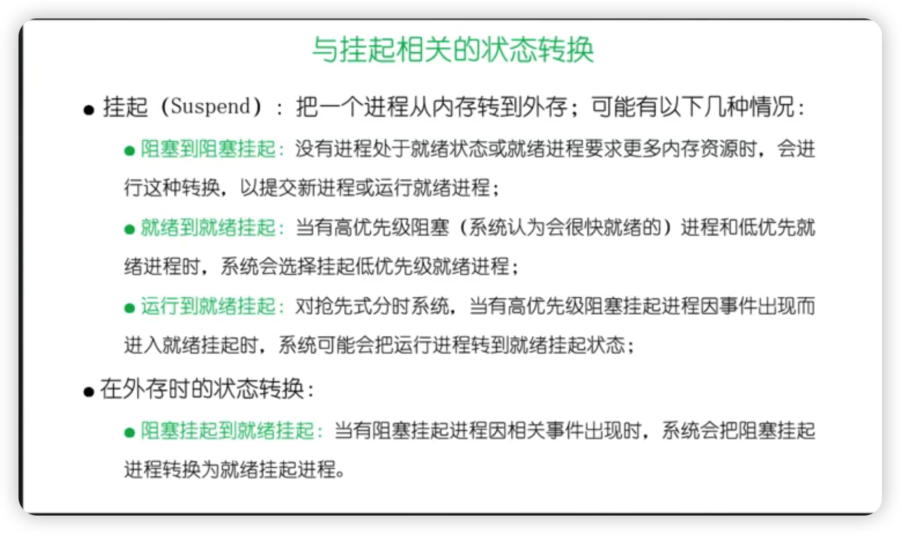

.png)

### 什么是线程

概念：**进程当中的一条执行流程**

线程的优点：

* 一个进程中可以同时存在多个线程；
* 各个线程之间可以并发地执行；
* 各个线程之间可以共享地址空间和文件等资源。

线程的缺点：

* 一个线程崩溃，会导致其所属进程的所有线程崩溃。

线程与进程的比较：

* 进程是资源分配单位，线程是CPU调度单位；
* 进程拥有一个完整的资源平台，而线程只独享必不可少的资源，如寄存器和栈；
* 线程同样具有就绪、阻塞和执行三种基本状态，同样具有状态之间的转换关系；
* 线程能减少并发执行的时间和空间开销：
  * 线程的创建时间比进程短；
  * 线程的终止时间比进程短；
  * 同一进程的的线程切换时间比进程短；
  * 由于同一进程的各线程间共享内存和文件资源，可直接进行不通过内核的通信；

### 线程的实现

用户线程与内核线程的关系：

* 多对一
* 一对一
* 多对多


### 进程控制

#### 进程创建

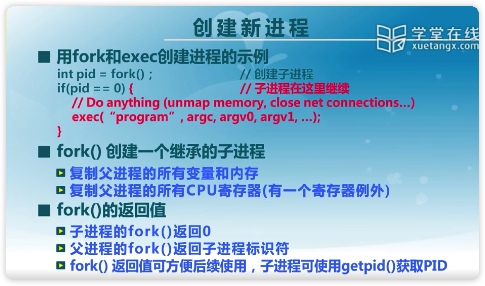

#### 加载和执行进程

* Exec()调用允许一个进裕4加载”一个不同的程序并且在main开始执行（事实上 _start）
* 它允许一个进程指定参数的数量(argc) 和它字符串参数数组 (argv).
* 如果调用成功
  * 它是相同的进程⋯
  * 但是它运行了一个不同的程序！！

* 代码，stack（栈）＆ heap（堆）重写

  ***

* fork（）的简单实现：
  * 对子进程分配内存
  * 复制父进程的內存和CPU寄存器到子进程里
  * 开销昂贵！！

* 在99%的情况里，我们在调用fork()之后调用exec()
  * 在fork（）操作中内存复制是没有作用的
  * 子进程将可能关闭打开的文件和连接
  * 开销因此是高的

* vfork()
  * 一个创建进程的系统调用，不需要创建一个同样的内存映像
  * 一些时候称为轻量级fork0
  * 子进程应该几乎立即调用exec (
  * 现在不再使用如我们使用 Copy on write (COw）技术

#### 等待和终止进程

wait()系统调用是被父进程用来等待子进程的结束

* 一个子进程向父进程返回一个值，所以父进程必须接受这个值并处理
* wait()系统调用担任这个要求
  * 它使父进程去睡眠来等待子进程的结果
  * 当一个子进程调用exit(的时候，操作系统解锁父进程，并且将通过exit()传递得到的返回值作为wait调用的一个结果（连同子进的pid一起）如果这里没有子进程存活，waitO立刻返回
  * 当然，如果这里有为父进程的僵尸等待，wait(）立即返回其中一个值（并且解除僵尸状态）

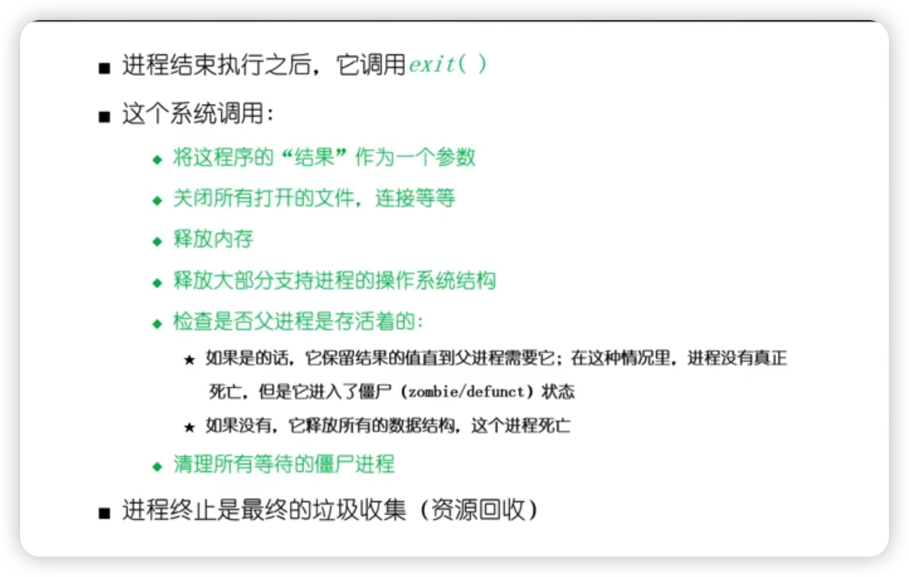

### 调度原则

评价指标

* CPU使用率
  * CPU处于忙状态所占时间的百分比
* 吞吐量
  * 在单位时间内完成的进程数量
* 周转时间
  * 一个进程从初始化到结束，包括所有等待时间所花费的时间
* 等待时间
  * 进程在就绪队列中的总时间
* 响应时间
  * 从一个请求被提交到产生第一次响应所花费的总时间

调度算法的效果

* 减少响应时间
  * 及时处理用户的输出并且尽快将输出提供给用户
* 减少平均响应时间的波动
  * 在交互系统中，可预测性比高差异低平均更重要
* 增加吞吐量-两个方面
  * 减少开销（操作系统开销，上下文切换）
  * 系统资源的高效利用（CPU，I/0设备）
* 减少等待时间
  * 减少每个进程的等待时间

### 调度算法

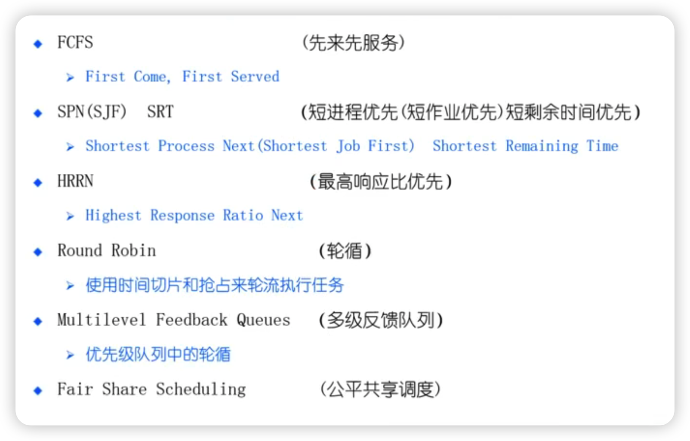

1. 先来先服务调度算法

   **先来先服务(FCFS)调度算法是一种最简单的调度算法，该算法既可用于作业调度，也可用于进程调度。当在作业调度中采用该算法时，每次调度都是从后备作业队列中选择一个或多个最先进入该队列的作业，将它们调入内存，为它们分配资源、创建进程，然后放入就绪队列。在进程调度中采用FCFS算法时，则每次调度是从就绪队列中选择一个最先进入该队列的进程，为之分配处理机，使之投入运行。该进程一直运行到完成或发生某事件而阻塞后才放弃处理机。**

2. 短作业(进程)优先调度算法

   **短作业(进程)优先调度算法，是指对短作业或短进程优先调度的算法。它们可以分别用于作业调度和进程调度。短作业优先(SJF)的调度算法是从后备队列中选择一个或若干个估计运行时间最短的作业，将它们调入内存运行。而短进程优先(SPF)调度算法则是从就绪队列中选出一个估计运行时间最短的进程，将处理机分配给它，使它立即执行并一直执行到完成，或发生某事件而被阻塞放弃处理机时再重新调度。**

3. 时间片轮转法

​		**在早期的时间片轮转法中，系统将所有的就绪进程按先来先服务的原则排成一个队列，每次调度时，把CPU分配给队首进程，并令其		执行一个时间片。时间片的大小从几ms到几百ms。当执行的时间片用完时，由一个计时器发出时钟中断请求，调度程序便据此信号		来停止该进程的执行，并将它送往就绪队列的末尾；然后，再把处理机分配给就绪队列中新的队首进程，同时也让它执行一个时间		片。	这样就可以保证就绪队列中的所有进程在一给定的时间内均能获得一时间片的处理机执行时间。换言之，系统能在给定的时间		内响应所有用户的请求。**

4. 多级反馈队列调度算法

​		**前面介绍的各种用作进程调度的算法都有一定的局限性。如短进程优先的调度算法，仅照顾了短进程而忽略了长进程，而且如果并		未指明进程的长度，则短进程优先和基于进程长度的抢占式调度算法都将无法使用。而多级反馈队列调度算法则不必事先知道各种进		程所需的执行时间，而且还可以满足各种类型进程的需要，因而它是目前被公认的一种较好的进程调度算法。在采用多级反馈队列		调算法的系统中，调度算法的实施过程如下所述：**

​	1）应设置多个就绪队列，并为各个队列赋予不同的优先级。第一个队列的优先级最高，第二个队列次之，其余各队列的优先权逐个降	低。该算法赋予各个队列中进程执行时间片的大小也各不相同，在优先权愈高的队列中，为每个进程所规定的执行时间片就愈小。例	      	如，第二个队列的时间片要比第一个队列的时间片长一倍，第i+1个队列的时间片要比第i个队列的时间片长一倍。

​	2）当一个新进程进入内存后，首先将它放入第一队列的末尾，按FCFS原则排队等待调度。当轮到该进程执行时，如它能在该时间片内	完成，便可准备撤离系统；如果它在一个时间片结束时尚未完成，调度程序便将该进程转入第二队列的末尾，再同样地按FCFS原则等	待调度执行；如果它在第二队列中运行一个时间片后仍未完成，再依次将它放入第三队列，……，如此下去，当一个长作业(进程)从第一	队列依次降到第n队列后，在第n队列便采取按时间片轮转的方式运行。

​	3）仅当第一队列空闲时，调度程序才调度第二队列中的进程运行；仅当第1～(i-1)队列均空时，才会调度第i队列中的进程运行。如果处	理机正在第i队列中为某进程服务时，又有新进程进入优先权较高的队列(第1～(i-1)中的任何一个队列)，则此时新进程将抢占正在运行进	程的处理机，即第i队列中某个正在运行的进程的时间片用完后，由调度程序选择优先权较高的队列中的那一个进程，把处理机分配给	它。

​	

5. 优先权调度算法

​	**为了照顾紧迫型作业，使之在进入系统后便获得优先处理，引入了最高优先权优先(FPF)调度算法。此算法常被用于批处理系统中，作	为作业调度算法，也作为多种操作系统中的进程调度算法，还可用于实时系统中。当把该算法用于作业调度时，系统将从后备队列中选	择若干个优先权最高的作业装入内存。当用于进程调度时，该算法是把处理机分配给就绪队列中优先权最高的进程，这时，又可进一步	把该算法分成如下两种。**

​	1）非抢占式优先权算法

​	在这种方式下，系统一旦把处理机分配给就绪队列中优先权最高的进程后，该进程便一直执行下去，直至完成；或因发生某事件使该进	程放弃处理机时，系统方可再将处理机重新分配给另一优先权最高的进程。这种调度算法主要用于批处理系统中；也可用于某些对实时	性要求不严的实时系统中。

​	2）抢占式优先权调度算法

​	在这种方式下，系统同样是把处理机分配给优先权最高的进程，使之执行。但在其执行期间，只要又出现了另一个其优先权更高的进程     	，进程调度程序就立即停止当前进程(原优先权最高的进程)的执行，重新将处理机分配给新到的优先权最高的进程。因此，在采用这种	调度算法时，是每当系统中出现一个新的就绪进程i时，就将其优先权Pi与正在执行的进程j的优先权Pj进行比较。如果Pi≤Pj，原进程Pj	便继续执行；但如果是Pi>Pj，则立即停止Pj的执行，做进程切换，使i进程投入执行。显然，这种抢占式的优先权调度算法能更好地满	足紧迫作业的要求，故而常用于要求比较严格的实时系统中，以及对性能要求较高的批处理和分时系统中。

### 进程同步和互斥

原子操作：**原子操作是指一次不存在任何中断或失败的执行**

临界区：**临界区是指进程中的一段需要访问共享资源并且当另一个进程处于相应代码区域时便不会被执行的代码区域**

互斥：**当一个进程处于临界区并访问共享资源时，没有其他进程会处于临界区并且访问任何相同的共享资源**

死锁：**两个或以上的进程，在相互等待完成特定任务，而最终没法将自身任务进行下去**

饥饿：**一个可执行的进程，被调度器持续忽略，以至于虽然处于可执行状态却不被执行**

方法一：禁用硬件中断

* 没有中断，没有上下文切换，因此没有并发
  * 硬件将中断处理延迟到中断被启用之后
  * 大多数现代计算机体系结构都提供指令来完成

* 进入临界区
  * 禁用中断

* 离开临界区
  * 开启中断

方法二：基于软件的解决方案

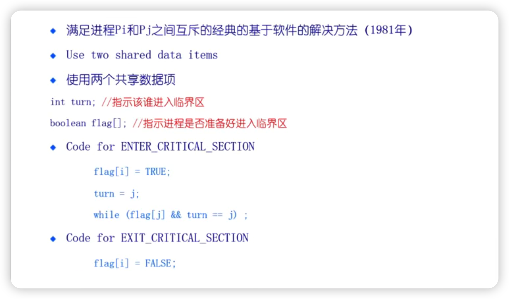

方法3:更高级的抽象

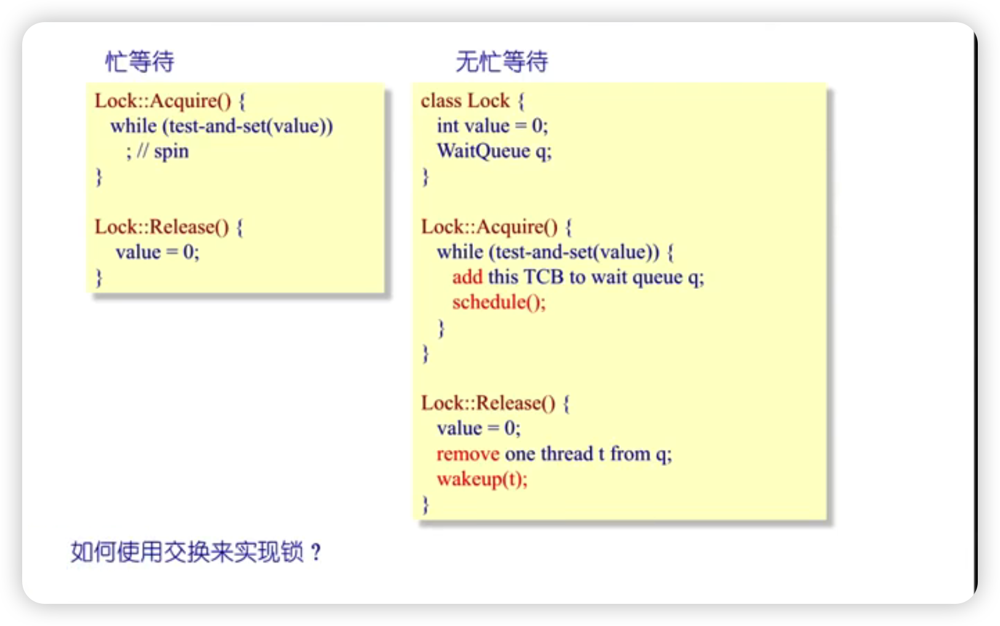

优点：

* 适用于单处理器或者共享主存的多处理器中任意数量的进程
* 简单并且容易证明
* 可以用于支持多临界区

缺点：

* 忙等待消耗处理器时间
* 当进程离开临界区并且多个进程在等待的时候可能导致饥饿
* 死锁
  * 如果一个低优先级的进程拥有临界区并且一个高优先级进程也需求，那么高优先级进程会获得处理器并等待临界区

### 信号量

* 抽象数据类型
  * 一个整形（sem)，两个原子操作
  * P():sem减1，如果 sem<0，等待，否则继续
  * V()：sem加1，如果 sem<=0，唤醒一个等待的P

### 信号量的使用

* 信号量是整数
* 信号量是被保护的变量
  * 初始化完成后，唯一改变一个信号量的值的办法是通过P()和Y()
  * 操作必须是原子
* PO()能够阻塞，V()不会阻塞
* 我们假定信号量是“公平的”
  * 没有线程被阻塞在P()仍然堵塞如果V()被无限频繁调用（在同一个信号量）
  * 在实践中，FIFO经常被使用


### 信号量的实现

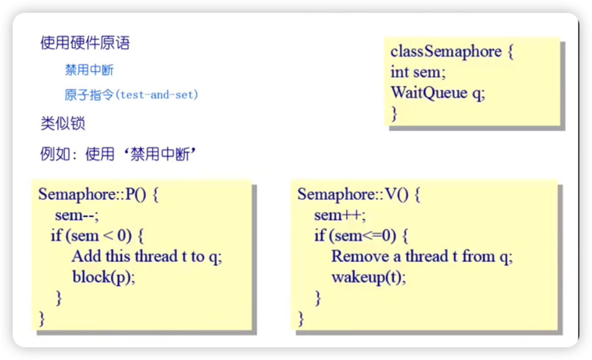

### 管程

什么是管程？

* 一个锁：**指定临界区**
* 0或者多个条件变量：**等待/通知信号量用于管理并发访问共享数据**

一般方法：

* **收集在对象/模块中的相关共享数据**
* **定义方法来访问共享数据**

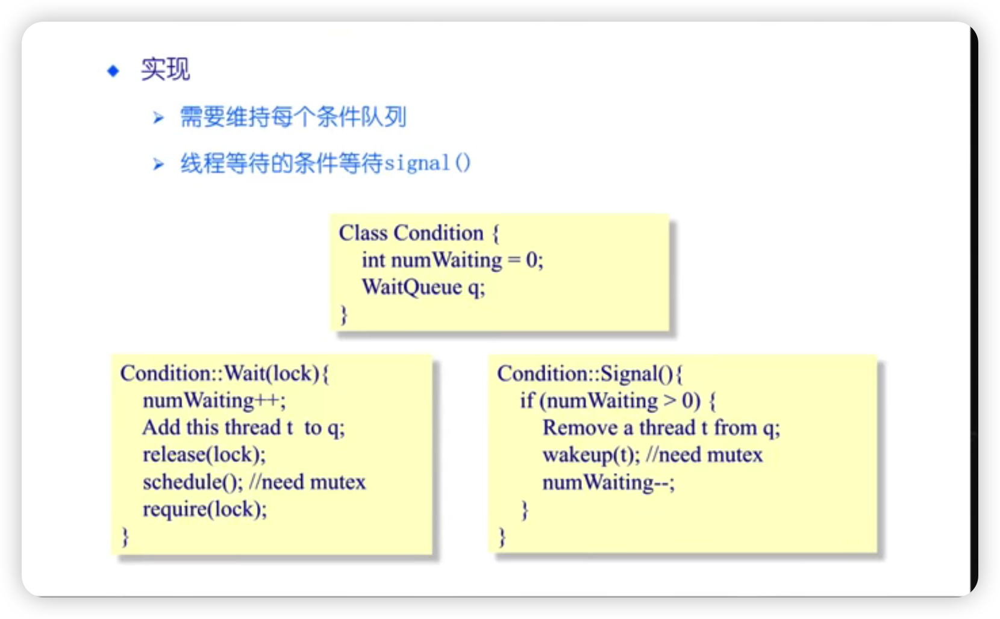

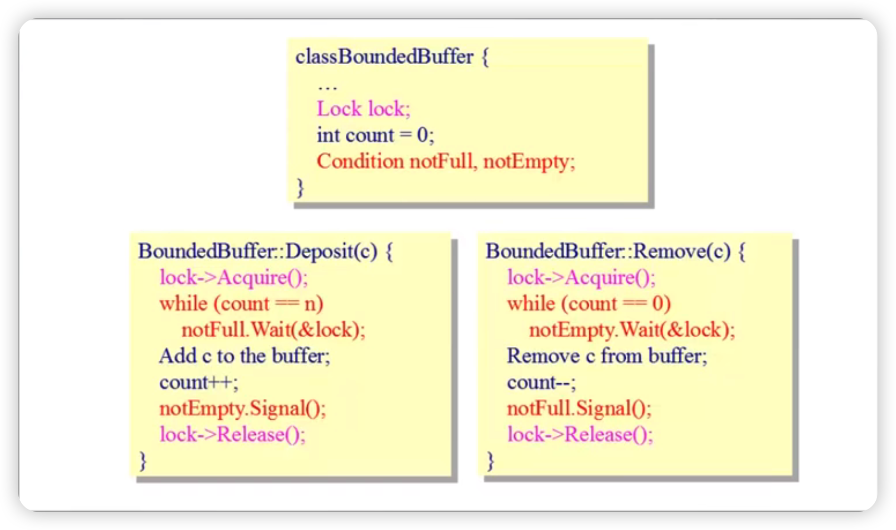

管程条件变量的释放处理方式：

**进程A执行，被阻塞，进入等待队列，切换到进程B，当进程B执行signal操作使进程A可以执行时，有两种方式：一种是等进程B执行完再执行进程A，另一种是立即切换到进程A，等执行完进程A再切换到进程B，执行进程B。**

**第二种比第一种多了一次切换，所以第一种比较高效，但第二种容易证明其正确性。第一种主要用于真实OS和Java中，第二种主要见于教材中。**

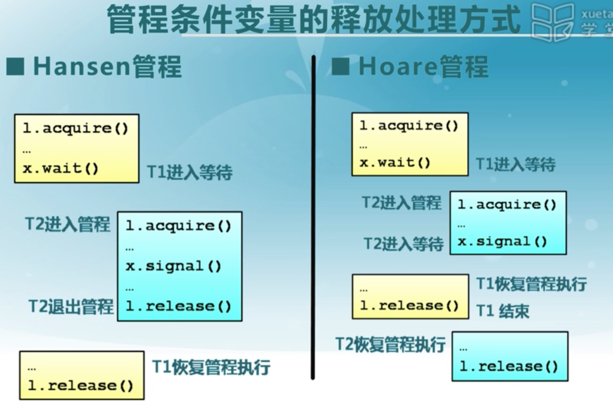

###  经典同步问题

#### 读者-写者问题

读者优先：

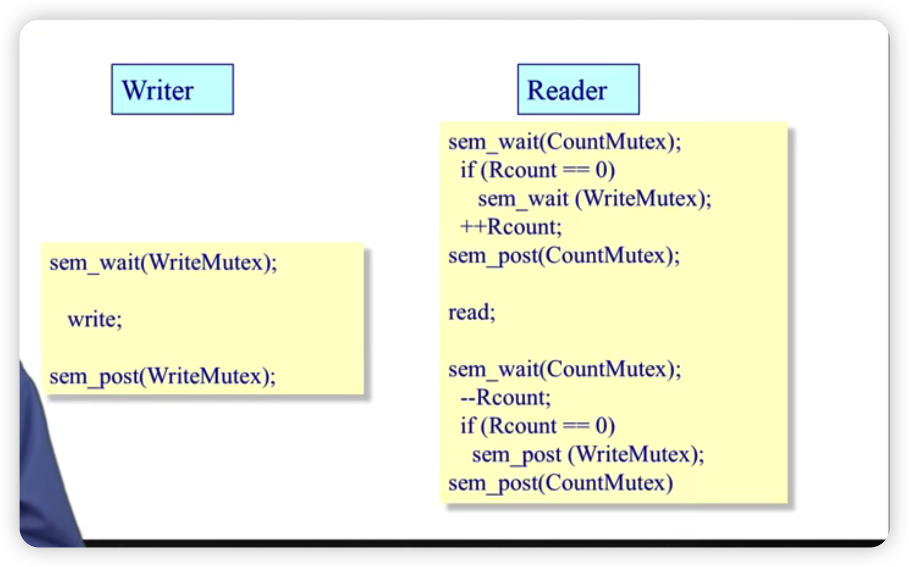

**基于读者优先策略的方法：只要有一个读者处于活动状态，后来的读者都会被接纳。如果读者源源不断地出现的话，那么写者就始终处于阻塞状态。**

**基于写者优先策略的方法：一旦写者就绪，那么写者会尽可能快地执行写操作。如果写者源源不断地出现的话，那么读者就始终处于阻塞状态。（如何实现？）**

#### 哲学家就餐问题

```C++
class Philosopher{
public:
    void philosopher(int i);

private:
    void think(){};
    void eat(){};
    void take_forks(int i);
    void put_forks(int i);
    void test_take_left_right_forks(int i);

    static const int N=5;                           // 哲学家人数
    enum class state{EATING, WAITING, THINKING};    // 3种状态
    state states[N];                                // 哲学家的状态
    semaphore s[N];                                 // 均初始化为0，用于同步调度
    semaphore mutex;                                // 用于互斥操作

};

void Philosopher::philosopher(int i) {
    while(true){
        think();
        take_forks(i);
        eat();
        put_forks(i);
    }
}

// 原子操作：要么同时拿两把叉子，要么进入等待
void Philosopher::take_forks(int i) {
    mutex.P();

    states[i]=state::WAITING;
    test_take_left_right_forks(i);

    mutex.V();

    s[i].P();   // 没有叉子便阻塞
}

// 试图拿两把叉子
void Philosopher::test_take_left_right_forks(int i) {
    if(states[i]==state::WAITING&&states[(i-1+N)%N]==state::THINKING&&states[(i+1)%N]==state::THINKING){
        states[i]=state::EATING;
        s[i].V();   // 有叉子，所以通知自己不用阻塞
    }
}

// 原子操作：同时放两把叉子，同时将身边等待的哲学家唤醒
void Philosopher::put_forks(int i) {
    mutex.P();

    states[i]=state::THINKING;
    test_take_left_right_forks((i-1+N)%N);
    test_take_left_right_forks((i+1)%N);

    mutex.V();
}
```
